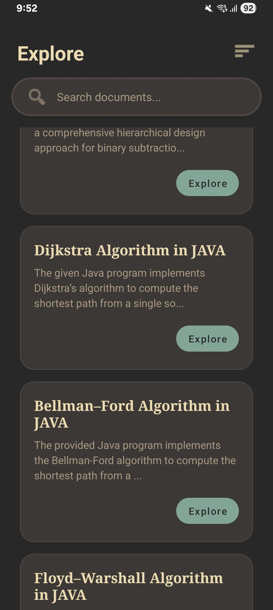
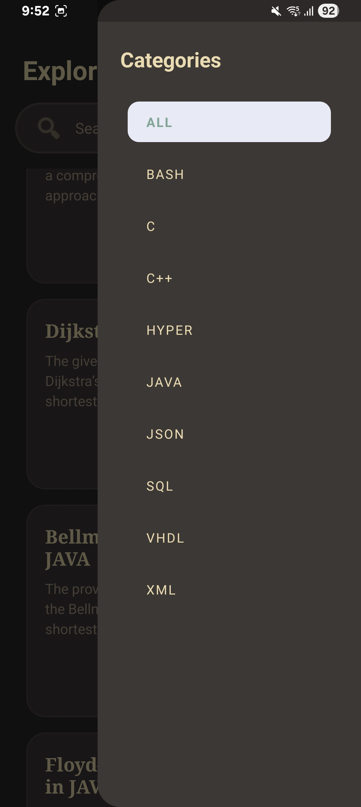
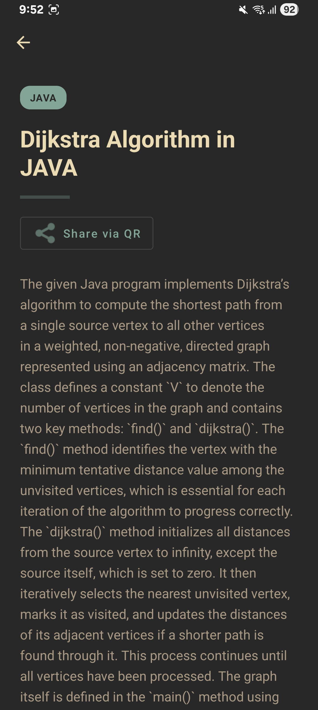
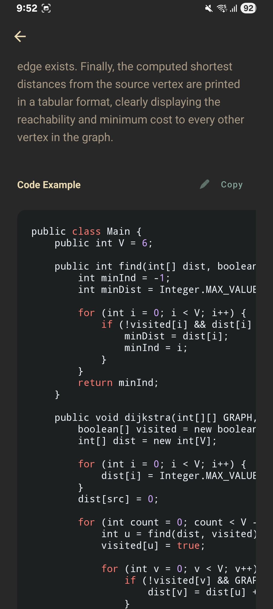
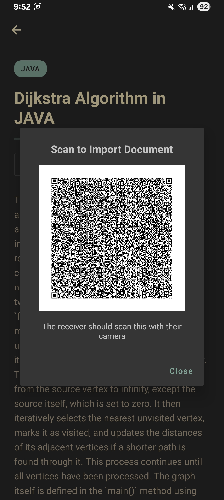

# 📱 bDoci: The Developer's Pocket Knowledge Base


**bDoci** is a beautifully crafted, native Android application acting as the mobile client for the Documentation Hub ecosystem. Designed for developers, by a developer, it provides lightning-fast, beautifully rendered access to technical documentation, algorithm explanations, and code snippets.

Built with modern Android development practices, a bespoke "Gruvbox" aesthetic, and an incredibly robust offline-first architecture, bDoci ensures your knowledge is always in your pocket—and even floats over your other apps.

---

## ✨ Flagship Features

### 🪟 Floating Window Companion (PiP Mode)

Context switching on mobile is frustrating. bDoci features a native **System Alert Window** service that drops a draggable, Gruvbox-styled floating bubble onto your screen.

- Watching a programming tutorial on YouTube? Tap the bubble to expand a transparent mini-panel over your video.
- Instantly search your knowledge base, copy a code snippet to your clipboard, and dismiss the panel without ever pausing your video or leaving the app you are in.

### 📡 Offline P2P Sync (QR Deep-Linking)

bDoci breaks the barrier of internet dependency with its **Offline Peer-to-Peer Sharing**.

- Find a vital algorithm while completely offline? Tap "Share" to serialize the document into a Base64-encoded JSON payload, which is instantly converted into a custom `bdoci://share` QR code.
- A teammate scans the code using their native camera. Android's Intent system catches the deep link, launches bDoci, decodes the payload, and injects the document directly into their local Room Database.

### 🔔 Real-Time Push Notifications

Integrated with **Firebase Cloud Messaging (FCM)**, the app utilizes a silent, event-driven server-side push architecture. The exact millisecond a new note is uploaded to the MongoDB backend via the web dashboard, an FCM `data` payload is broadcasted, instantly triggering a native Android notification on your device with zero battery drain or background polling.

### 🎨 Custom "Gruvbox-Chic" Aesthetic

Moving away from the harsh glaring whites of standard Material Design, bDoci utilizes a warm, high-end, custom UI.

- **Floating UI:** Document cards and search bars feature deep rounded corners and soft elevation shadows, creating a "floating" layered effect.
- **Code Containers:** Code snippets are housed in deep, warm dark `#282828` containers, ensuring monospace syntax pops beautifully without straining the eyes.
- **Dynamic Sidebar:** A scrollable, pill-shaped side navigation bar allows users to instantly filter their cached knowledge base by tags (e.g., C++, Java, Linux).

### 🗃️ True Offline-First Architecture

- Powered by an SQLite-abstracted **Room Database**, every document fetched from the live backend is intelligently cached.
- Custom `NetworkUtils` passively monitor connectivity. If you open the app without Wi-Fi, bDoci instantly falls back to your local cache. A dynamic **Offline Status Indicator** seamlessly updates the UI to reflect your connection state.

### 🔎 Dynamic Text Scaling (Precision Slider)

- Reading dense technical documentation on a mobile screen can quickly cause eye strain. bDoci solves this with an intuitive, built-in zoom slider directly accessible within the reading view. Users can dynamically and smoothly scale the font size of complex algorithms and detailed explanations on the fly using the slider, ensuring maximum readability without ever having to dig through a settings menu.

### 🌈 Native Offline Syntax Highlighting

- Say goodbye to flat, plain-text code blocks. The dedicated code viewer features a built-in, completely offline syntax highlighting engine. It automatically detects the document's programming language (C++, Python, Java, etc.) and color-codes the logic to match professional IDE environments, housed beautifully within our custom Gruvbox dark containers.

### 📊 Dynamic Reading Progress Slider

- Never lose your place in a massive documentation file or extensive tutorial. A sleek, unobtrusive reading progress indicator sits at the edge of the reading screen. It updates in real-time as you scroll through the `RecyclerView` or text blocks, providing immediate visual feedback on your exact position within the document.

### 📡 Offline P2P Sync (QR Deep-Linking)

- bDoci breaks the barrier of internet dependency with its flagship offline sharing. Find a vital code snippet while disconnected? Tap "Share" to serialize the document into a Base64-encoded JSON payload, which is instantly converted into a custom `bdoci://share` QR code. A teammate can scan the code using their native camera, and Android's Intent system will catch the deep link, launch bDoci, and inject the document directly into their local Room Database. True zero-network collaboration.

---

## 📸 Sample Screens

<p align="center">
  
  
  
  
  
</p>

---

## 🛠️ Tech Stack & Engineering

bDoci strictly adheres to the **MVVM (Model-View-ViewModel)** architectural pattern, ensuring clean separation of concerns, testability, and a crash-free, lifecycle-aware UI.

- **Language:** Kotlin
- **Architecture:** MVVM + Single Source of Truth Repository Pattern
- **Networking:** Retrofit2 & OkHttp3
- **Local Storage:** Room Database
- **Asynchronous Execution:** Kotlin Coroutines & `lifecycleScope`
- **Background Services:** FirebaseMessagingService & Android `WindowManager`
- **JSON Serialization:** Gson
- **QR Generation:** ZXing Core
- **UI Components:** Complex XML Layouts, Customized State Selectors, ConstraintLayouts, and RecyclerViews.

---

## 📂 Project Structure

```text
com.example.bdoci
│
├── app/                  # Main BDociApp Initialization
├── database/             # Offline Caching (AppDatabase, DocDao)
├── models/               # Serialized Data classes (Doc.kt)
├── network/              # Retrofit routing & Firebase (MyFirebaseMessagingService)
├── repository/           # Single source of truth (DocRepository)
├── utils/                # Helper singletons (NetworkUtils, QRUtils)
├── viewmodels/           # Lifecycle-aware logic (DocViewModel)
│
├── Dashboard.kt          # Main List, Search, Category Filtering & Deep Links
├── DocDetailActivity.kt  # Document Reader & QR Generation
├── FloatingDocService.kt # WindowManager Service for the PiP Widget
├── DocAdapter.kt         # Adapter for floating document cards
└── CategoryAdapter.kt    # Adapter for sidebar navigation pills
```

---

## 🚀 Getting Started

### Prerequisites

- Android Studio (Latest Version)
- Minimum SDK: API 27 (Android 8.1)
- Target SDK: API 36

### Installation

1. **Clone the repository:**

   ```bash
   git clone https://github.com/Bimbok/bdoci-app.git
   ```

2. **Firebase Setup (Crucial):**
   - This project requires a `google-services.json` file to compile successfully due to the FCM integration.
   - Create a Firebase Project, register your Android App with the matching Application ID, download the `google-services.json` file, and place it inside the `/app` directory. _(Note: This file is intentionally `.gitignore`d for security)._

3. **Open & Sync:** Open the project in Android Studio. Wait for Gradle to sync dependencies.
4. **Run:** Select your target emulator or physical device and run the application.

_Note: This mobile app is designed as a highly optimized, read-only client. Documentation authoring, Markdown formatting, and database administration are handled exclusively via the accompanying Node.js web dashboard._

---

## 👨‍💻 Developed By

    **Bimbok** _Architected and developed as a comprehensive mobile companion for high-performance developer workflows._
