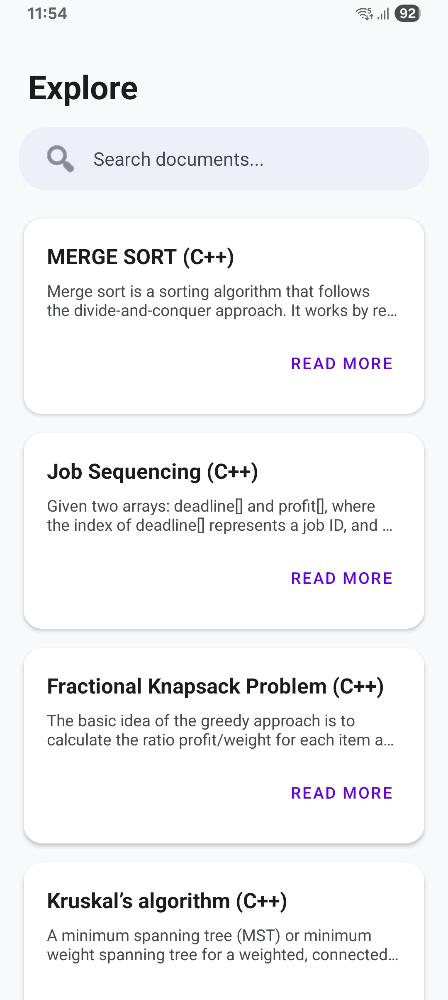
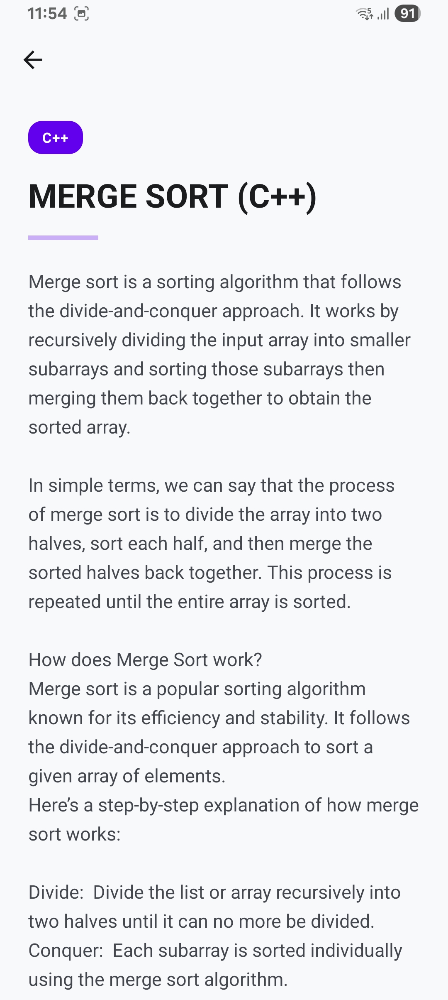
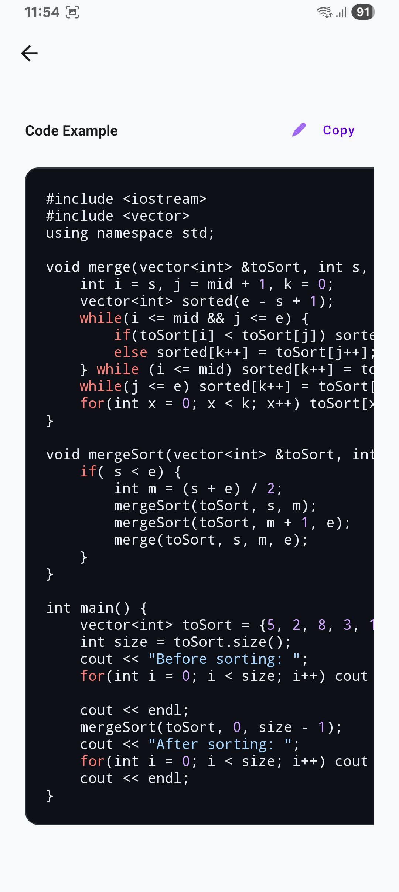

# 📱 bDoci


**bDoci** is a native Android application built to seamlessly interface with the Documentation Hub backend. It provides developers and users with instant access to technical documentation, algorithm explanations, and code snippets on the go.

Built with modern Android development practices, bDoci ensures a lightning-fast, offline-capable, and visually rich reading experience.

---

## ✨ Key Features

- **📚 Centralized Dashboard:** Browse all available documentation cards instantly upon launch.
- **🔍 Real-Time Search:** Instantly filter documents by title with a highly responsive, custom-styled search bar.
- **💾 Offline-First Architecture:** Documents are locally cached using Room Database. Read your saved documentation even when your device loses internet connection!
- **💻 Dedicated Code Viewer:** Code snippets are displayed in a beautifully styled, monospace dark-theme container for maximum readability.
- **🎨 Custom UI/UX:** Features a polished interface with rounded card layouts, category badges, dynamic loading states, and offline status indicators.
- **🛡️ Production-Ready Networking:** Built-in interceptors to handle browser-like requests, preventing server/bot blocking and handling rate limits gracefully.

---

## 📸 Sample Screens

<p align="center">
  
  
  
</p>

---

## 🛠️ Tech Stack & Architecture

This application strictly follows the **MVVM (Model-View-ViewModel)** architectural pattern to ensure separation of concerns, testability, and a robust lifecycle-aware UI.

- **Language:** Kotlin
- **Architecture:** MVVM + Repository Pattern
- **Networking:** Retrofit2 & OkHttp3 (with custom interceptors)
- **Local Storage (Caching):** Room Database (SQLite abstraction)
- **Asynchronous Programming:** Kotlin Coroutines & Flow/LiveData
- **JSON Parsing:** Gson
- **UI Components:** XML Layouts, RecyclerView, ConstraintLayout, Material Design principles.

### 🏗️ Architecture Flow

1.  **UI Layer (`Dashboard.kt`):** Observes data from the ViewModel.
2.  **ViewModel (`DocViewModel.kt`):** Manages UI state and requests data from the Repository.
3.  **Repository (`DocRepository.kt`):** Acts as the single source of truth. It checks the network via `NetworkUtils`. If online, it fetches from the Retrofit `ApiService` and caches the result in the Room database. If offline, it retrieves the cached data from the `DocDao`.
4.  **Data Sources:** \* _Remote:_ Express.js / MongoDB backend via REST API.
    - _Local:_ Room SQLite Database.

---

## 📂 Project Structure

```text
com.example.bdoci
│
├── app/                  # Main Application Class
├── database/             # Room DB setup (AppDatabase, DocDao)
├── models/               # Data classes (Doc.kt)
├── network/              # Retrofit setup (ApiClient, ApiService)
├── repository/           # Single source of truth (DocRepository)
├── ui/                   # Theme and styling configs
├── utils/                # Helper classes (NetworkUtils for connectivity)
├── viewmodels/           # Lifecycle-aware ViewModels (DocViewModel)
│
├── Dashboard.kt          # Main List & Search Screen
├── DocAdapter.kt         # RecyclerView Adapter for document cards
└── DocDetailActivity.kt  # Full Document & Code Reading Screen
```

---

## 🚀 Getting Started

### Prerequisites

- Android Studio (Latest Version recommended)
- Minimum SDK: API 24 (Android 7.0)
- Target SDK: API 34 (Android 14)
- A running instance of the [Documentation Hub backend](https://bimbokdocs.vercel.app/) (or update the `BASE_URL` in `ApiClient.kt` to your local `http://10.0.2.2:3000/`).

### Installation

1.  **Clone the repository:**
    ```bash
    git clone https://github.com/Bimbok/bdoci-app.git
    ```
2.  **Open the project:** Open Android Studio, select `File > Open`, and navigate to the cloned directory.
3.  **Sync Gradle:** Allow Android Studio to download the required dependencies (Retrofit, Room, Coroutines, etc.).
4.  **Run the App:** Select your emulator or physical device and click the ▶️ **Run** button.

---

## 📡 API Integration

The app connects to a RESTful JSON API. The primary endpoint utilized is:

- `GET /api/data` - Returns an array of document objects.

**Expected JSON Schema:**

```json
{
  "_id": "string",
  "title": "string",
  "document": "string",
  "category": "string",
  "code": "string (nullable)"
}
```

---

## 👨‍💻 Developed By

**Bimbok** _Architected and developed as the official mobile client for the Documentation Hub ecosystem._
