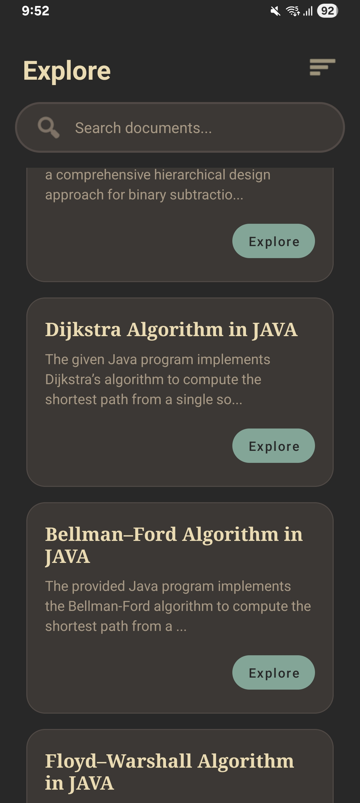
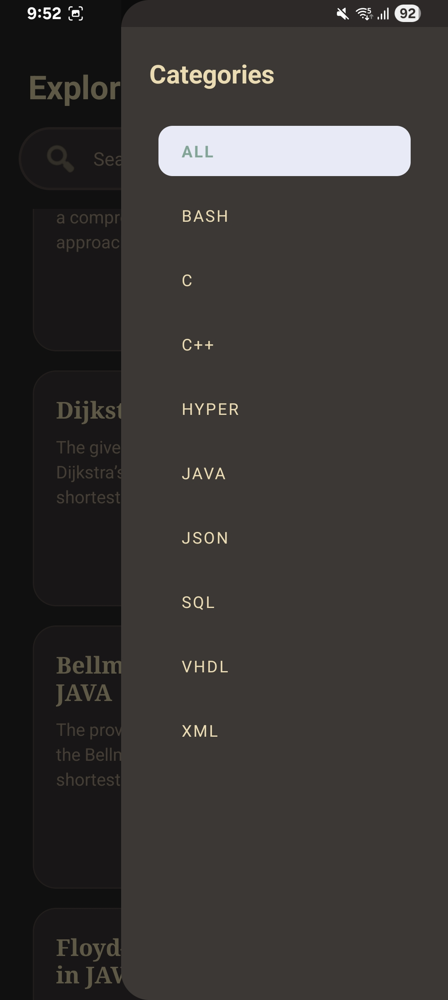
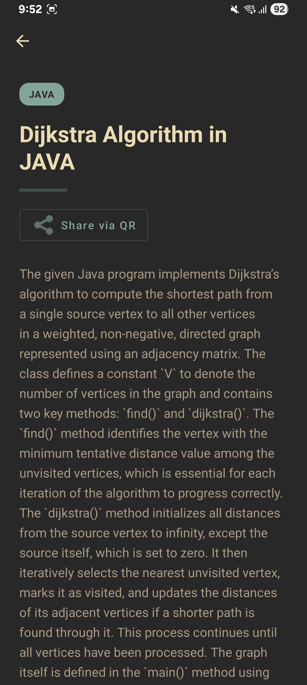
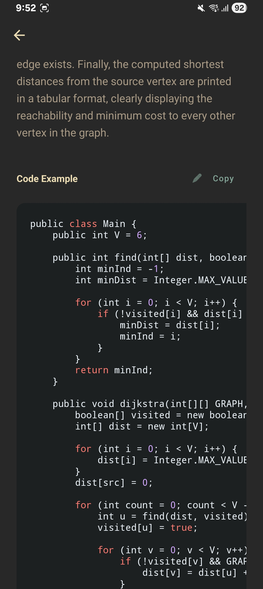
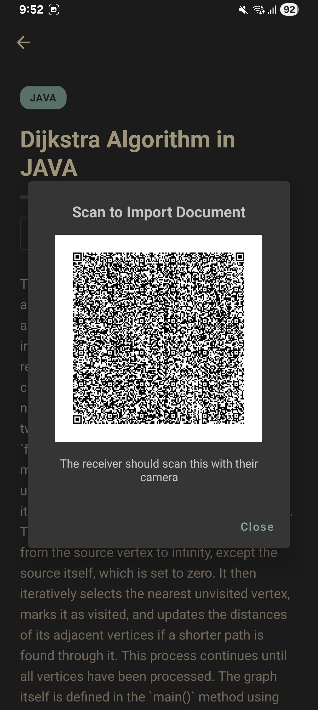
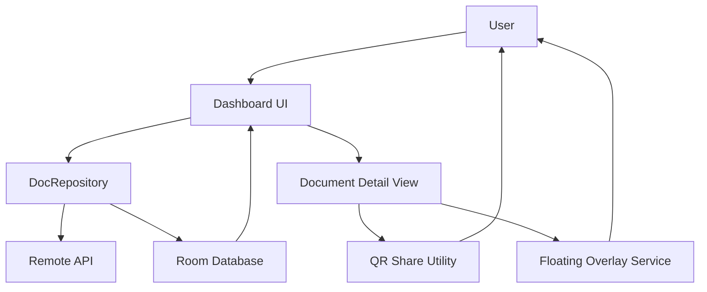

<div align="center">


# bDoci

**A modern Android documentation companion that keeps developer knowledge searchable, readable, and accessible even when you are offline.**

[](https://developer.android.com/)
[](https://kotlinlang.org/)
[](https://gradle.org/)
[](https://developer.android.com/training/data-storage/room)
[](https://firebase.google.com/)
[](LICENSE)

### 🚀 Highlights

Native Android app · Offline-first docs · Floating overlay access · QR deep-link sharing · Firebase push updates

### Lead Maintainer

<table>
  <tr>
    <td align="center" style="padding: 6px 18px;">
      <a href="https://github.com/Bimbok">
        
      </a>
      <br />
      <a href="https://github.com/Bimbok"><strong>@Bimbok</strong></a>
      <br />
      <a href="https://github.com/Bimbok">
        
      </a>
    </td>
  </tr>
</table>

<sub>Built and maintained by Bimbok.</sub>

</div>

---

## 💡 Project Purpose

Developers regularly jump between tutorials, notes, snippets, and reference material while coding. On mobile, that usually means slow context switching, poor readability, and no useful offline support.

**bDoci** solves that by turning documentation into a compact native Android experience. It lets users browse cached technical notes, open rich detail views, highlight code, share documents through QR-based deep links, and even access content through a floating overlay while using other apps.

---

## ✨ Features

| Feature | Description |
| --- | --- |
| **Offline-First Reading** | Cached documents remain available through Room Database, so important references stay accessible without internet. |
| **Floating Overlay Panel** | A native `SYSTEM_ALERT_WINDOW` service provides quick access to documentation on top of other apps. |
| **QR-Based Sharing** | Documents can be serialized into a `bdoci://share` deep link and exchanged offline through QR codes. |
| **Push Updates with FCM** | Firebase Cloud Messaging enables real-time update notifications without constant polling. |
| **Category Filtering & Search** | Browse documents faster with category pills, favorites, and in-app filtering. |
| **Code-Friendly Reading UI** | Dedicated reading surfaces and styled code containers improve technical content readability on mobile. |
| **Favorites System** | Frequently used documents can be pinned locally for quick repeat access. |
| **Connectivity Awareness** | Network state checks help the app adapt between live data and local cache smoothly. |

---

## 🎯 Why bDoci

Most developer note apps stop at basic text storage. bDoci is built around actual usage during learning and coding:

- Read technical content cleanly on mobile without relying on a browser tab jungle.
- Keep important references available when connectivity is unreliable.
- Pull documentation into a floating panel while watching tutorials or switching apps.
- Share docs directly between devices with QR-based deep links.

---

## 📸 App Preview

The sample screenshots are part of the project story, so they are kept here as a proper visual walkthrough of the app.

<p align="center">
  
  
  
  
  
</p>

---

## 🛠️ Tech Stack

### Android App

- **Language:** Kotlin
- **Architecture:** MVVM + Repository Pattern
- **UI:** Native Android Views with XML layouts
- **Build System:** Gradle Kotlin DSL
- **Local Storage:** Room Database
- **Networking:** Retrofit + Gson
- **Async Work:** Kotlin Coroutines
- **Messaging:** Firebase Cloud Messaging
- **Utilities:** ZXing for QR generation

### Platform Capabilities

- **Deep Links:** Custom `bdoci://share` import flow
- **Overlay Service:** `WindowManager` + foreground service
- **Connectivity Handling:** `ACCESS_NETWORK_STATE`
- **Modern Android Target:** `minSdk 27`, `targetSdk 36`

---

## 📋 Feature Snapshot

| Area | Included in bDoci |
| --- | --- |
| Document browsing | `Yes` |
| Offline caching | `Yes` |
| Favorites | `Yes` |
| Floating overlay access | `Yes` |
| QR-based local sharing | `Yes` |
| Firebase notifications | `Yes` |
| Deep-link document import | `Yes` |
| Native Android implementation | `Yes` |

---

## 🚀 Quick Start

Follow these steps to run bDoci locally.

### Prerequisites

- Android Studio
- JDK 11 or higher
- Android SDK for API 27+
- A Firebase project for push notification support

### Setup Steps

```bash
# 1. Clone the repository
git clone https://github.com/Bimbok/bdoci-app.git
cd bdoci-app

# 2. Add your Firebase config
# Place google-services.json inside the app/ directory

# 3. Open the project in Android Studio

# 4. Sync Gradle

# 5. Run on an emulator or physical device
```

If you do not add `google-services.json`, the project will not build successfully because Firebase Messaging is configured in the app.

### Recommended Test Flow

1. Launch the app and verify the dashboard loads.
2. Open a document detail screen and test scrolling/readability.
3. Star a document to confirm favorites persistence.
4. Test QR sharing/import flow on a second device if available.
5. Grant overlay permission and verify the floating service behavior.

---

## 🏗️ Architecture

bDoci is organized around a straightforward native Android MVVM flow where data retrieval, caching, and presentation stay clearly separated.

```text
app/src/main/java/com/example/bdoci/
├── app/                  # Application class and startup initialization
├── database/             # Room database and DAO layer
├── models/               # Document and favorites models
├── network/              # Retrofit client, API service, FCM service
├── repository/           # Data coordination between network and local cache
├── utils/                # Network and QR helpers
├── viewmodels/           # UI-facing business logic
├── Dashboard.kt          # Main document listing and category filtering
├── DocDetailActivity.kt  # Reader screen and share actions
├── FloatingDocService.kt # Floating overlay experience
├── DocAdapter.kt         # Document list adapter
└── CategoryAdapter.kt    # Category navigation adapter
```

### How It Works

1. **Data Fetching:** Retrofit retrieves documentation from the remote source.
2. **Caching:** Room persists documents and favorites for offline access.
3. **Presentation:** Activities, adapters, and view models render filtered document views.
4. **Sharing:** QR utilities package document data into a custom deep link format.
5. **Overlay Access:** The floating service exposes quick access without leaving the current app.

### Core Modules

- **Dashboard:** Entry point for category browsing, search, and filtered discovery.
- **Doc Detail:** Reading screen for content consumption, sharing, and focused access.
- **Favorites Layer:** Local persistence for quick retrieval of high-value documents.
- **Floating Service:** Overlay-first access path for multitasking workflows.
- **Push Layer:** Firebase-backed notifications for newly available content.

### System Flow


```mermaid
flowchart TD
    user[User]
    dashboard[Dashboard UI]
    repo[DocRepository]
    api[Remote API]
    db[Room Database]
    detail[Document Detail View]
    qr[QR Share Utility]
    overlay[Floating Overlay Service]

    user --> dashboard
    dashboard --> repo
    repo --> api
    repo --> db
    db --> dashboard
    dashboard --> detail
    detail --> qr
    detail --> overlay
    qr --> user
    overlay --> user
```

---

## 🤝 Contributing

Contributions are welcome if you want to improve the reading experience, add new capabilities, or strengthen the Android architecture.

1. Fork the repository.
2. Create a feature branch from `main`.
3. Make your changes with clear commits.
4. Test on a device or emulator.
5. Open a Pull Request with a concise description of the change.

For project standards and collaboration details, check [LICENSE](LICENSE) and the repository guidelines you maintain alongside the codebase.

### Good Contribution Areas

- UI polish and reading ergonomics
- Better offline-sync and import/export behavior
- Performance improvements for large document lists
- More resilient deep-link and QR handling
- Test coverage for repository and database behavior

---

## 📞 Contact

For issues, ideas, or collaboration:

- **GitHub:** [@Bimbok](https://github.com/Bimbok)
- **Issues:** Open a ticket in this repository

---

## 📄 License

Released under the [MIT License](LICENSE).

<p align="center">Built for developers who want their docs available anywhere.</p>
